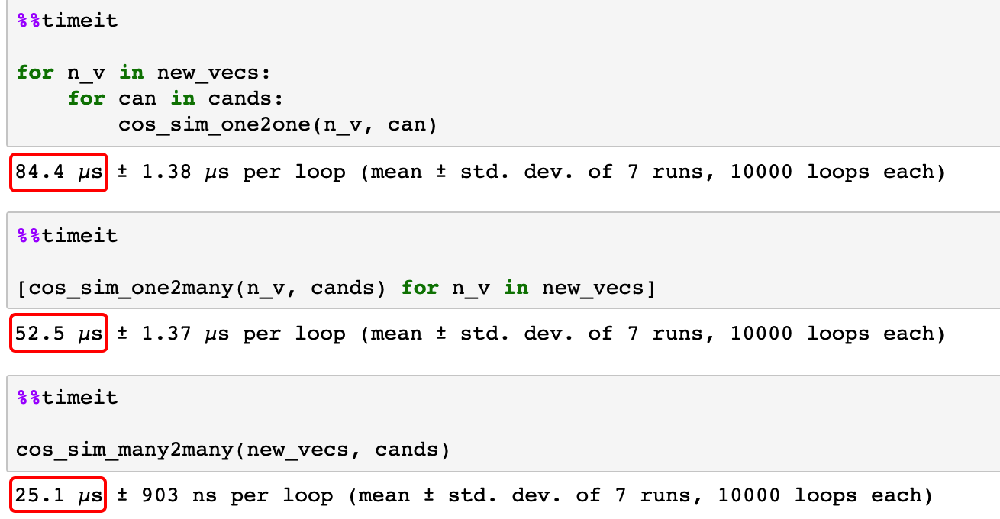

#### 1.代码
```python
import numpy as np


def cos_sim_one2one(vec1, vec2):
    _dot = np.dot(vec1, vec2)
    _norm = np.linalg.norm(vec1) * np.linalg.norm(vec2)
    _sim = _dot / _norm
    return _sim


def cos_sim_one2many(vec1, vecs):
    _dots = np.dot(vec1, vecs.T)
    _norms = np.linalg.norm(vec1) * np.linalg.norm(vecs, axis=1)
    _sims = _dots / _norms
    return _sims


def cos_sim_many2many(vecs1, vecs2):
    _dots = np.dot(vecs1, vecs2.T)
    _norms = np.linalg.norm(vecs1, axis=1).reshape(-1, 1) * np.linalg.norm(vecs2, axis=1)
    _sims = _dots / _norms
    return _sims


cands = np.array([[1, 2, 3],
                  [4, 5, 6]])

new_vec = np.array([1, 2, 3])

# cands = np.array([[1, 2, 3],
#                   [4, 5, 6],
#                   [7, 8, 9]])
new_vecs = np.array([[1, 2, 3],
                     [6, 5, 4]])
                     
```
#### 2. 评测
```python
%%timeit

for n_v in new_vecs:
    for can in cands:
        cos_sim_one2one(n_v, can)
```
```python
%%timeit

[cos_sim_one2many(n_v, cands) for n_v in new_vecs]
```
```python
%%timeit

cos_sim_many2many(new_vecs, cands)
```

#### 3.截图

