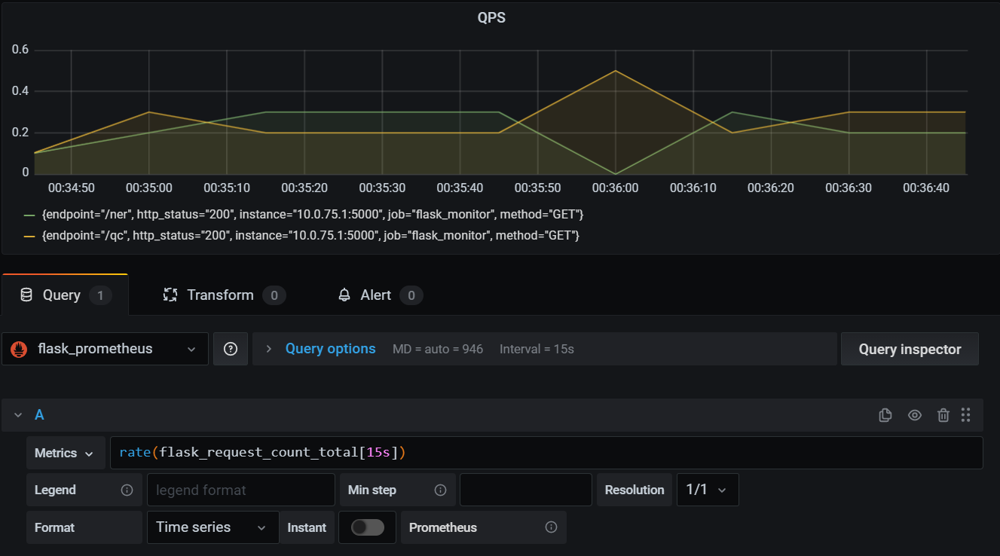

## 扩展Flask类，添加普米监控
```python
import time

import prometheus_client
from prometheus_client import Counter, Histogram
from flask import request, Flask, Blueprint, Response

FLASK_METRICS_Collector_Registry = prometheus_client.CollectorRegistry(auto_describe=False)

FLASK_REQUEST_LATENCY = Histogram('flask_request_latency_seconds', 'Flask Request Latency',
                                  ['method', 'endpoint'], registry=FLASK_METRICS_Collector_Registry)
FLASK_REQUEST_COUNT = Counter('flask_request_count', 'Flask Request Count',
                              ['method', 'endpoint', 'http_status'], registry=FLASK_METRICS_Collector_Registry)


def before_request():
    if request.path == "/metrics":
        return
    request.start_time = time.time()


def after_request(response):
    if request.path == "/metrics":
        return response
    request_latency = time.time() - request.start_time
    FLASK_REQUEST_LATENCY.labels(request.method, request.path).observe(request_latency)
    FLASK_REQUEST_COUNT.labels(request.method, request.path, response.status_code).inc()

    return response


metrics_blueprint = Blueprint("metrics", __name__)


@metrics_blueprint.route("/metrics")
def metrics():
    return Response(prometheus_client.generate_latest(FLASK_METRICS_Collector_Registry),
                    mimetype="text/plain")


class AiFlask(Flask):
    def __init__(self, *args, **kwargs):
        super().__init__(*args, **kwargs)
        self.before_request(before_request)
        self.after_request(after_request)
        self.register_blueprint(metrics_blueprint)

```

## 设置 grafna metrcis： rate(flask_request_count_total[15s]) * 100


